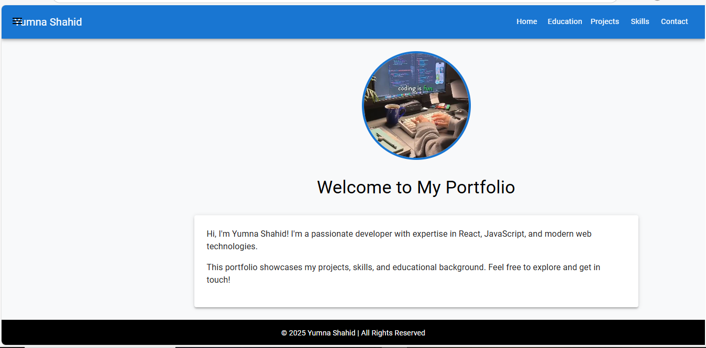
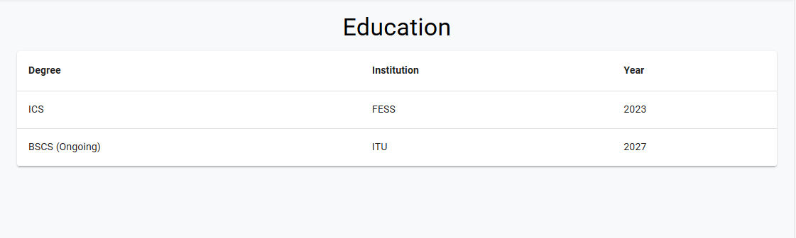
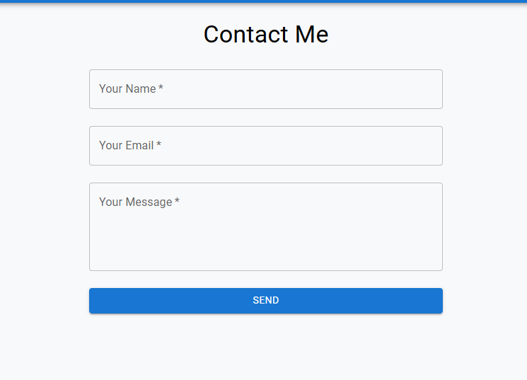
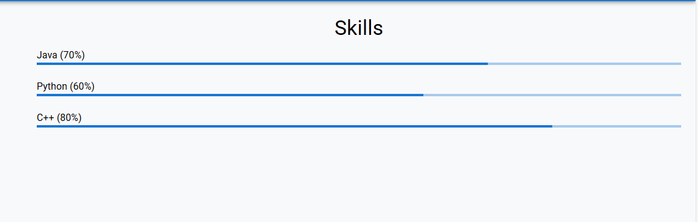
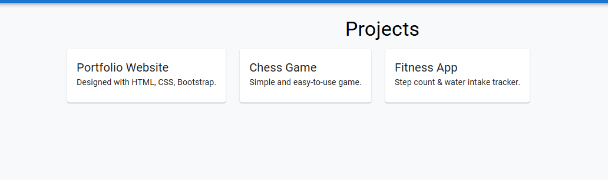
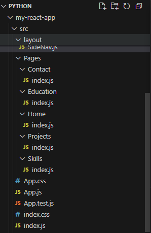

###React Portfolio with Material-UI

###Overview:

A modern portfolio website built with React 18, Material-UI (MUI), and CSS. Implements dynamic routing, responsive design, and React Context API following best practices.

###Features :

Component-Based Architecture

Responsive Layout (Desktop/Tablet/Mobile)

Dynamic Page Titles (Context API)

MUI Components (Drawer, AppBar, Cards, etc.)

Form Validation 

###Here are some of my screenshots of Portfolio website :

 ###Project Structure :
 

 

